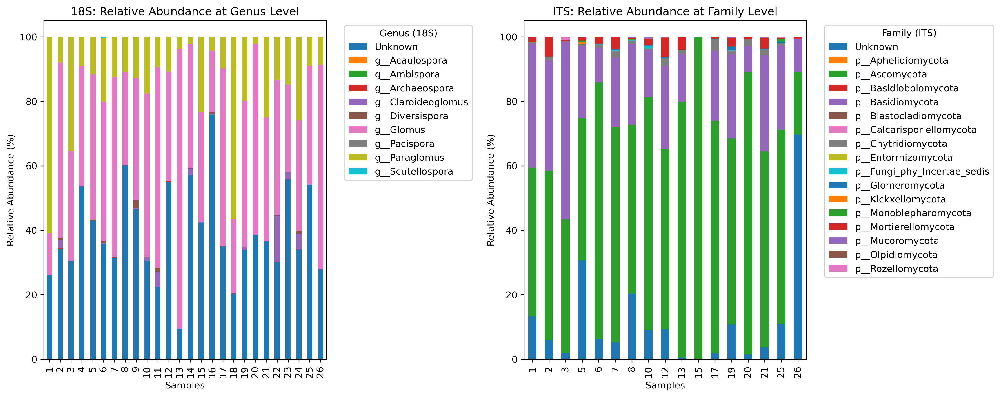
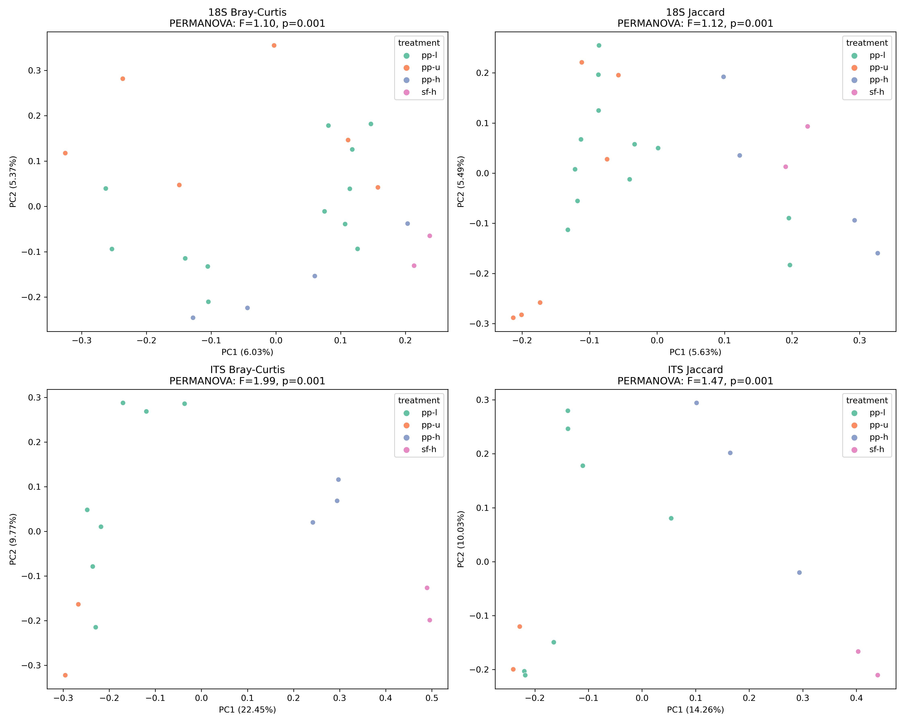

# mcnorvell
Preliminary data anlysis for Michael McNorvell project on 18S and ITS sequencing.

Figure 1. Relative abundance of 18S and ITS by sample.

Figure 2. Ordinations of Bray-Curtis (abundance weighted) and Jaccard (presence-absence) diversity metrics. PERMANOVA was used to determine significant differences, and the assumption of homogeneity of dispersion was met.

ITS Bray-Curtis PERMDISP p-value: 0.518

ITS Jaccard PERMDISP p-value: 0.666

18S Bray-Curtis PERMDISP p-value: 0.986

18S Jaccard PERMDISP p-value: 0.863
